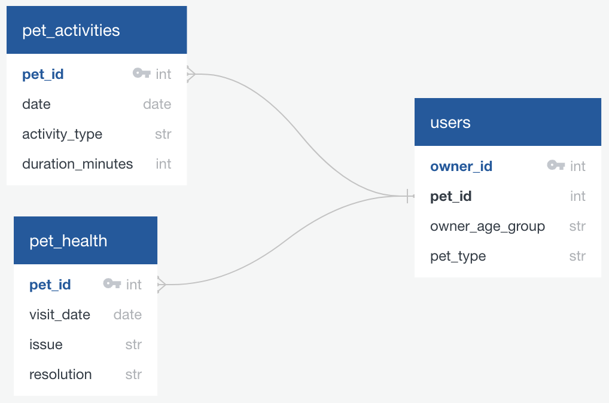

# Happy Paws - Pet Care Analytics Platform



## 📊 Project Overview

> **Note**: This project is based on a **Data Engineer Certification Sample Practical Exam**, representing real-world data engineering challenges and business scenarios.

HappyPaws creates fun and educational mobile applications for pet owners, helping them understand their pets better by tracking activities and health metrics. This data engineering project focuses on building a robust pipeline to organize and secure pet data from thousands of users, enabling personalized tips to keep pets happy and healthy.

## 🏗️ Project Structure

happy_paws/
├── data/
│ ├── raw/ # Original, immutable data
│ │ ├── pet_activities.csv # Pet activity tracking data
│ │ ├── pet_health.csv # Pet health metrics data
│ │ └── users.csv # User information data
│ └── processed/ # Cleaned and processed data
├── scripts/
│ ├── notebook.ipynb # Main analysis notebook
│ └── (future Python scripts)
├── docs/ # Project documentation
├── images/ # Visualizations and diagrams
│ └── image.png
├── README.md
└── .gitignore

## 📁 Datasets Description

### Raw Data Files (`data/raw/`)
- **`pet_activities.csv`**: Daily activity tracking, exercise patterns, behavior metrics
- **`pet_health.csv`**: Health indicators, veterinary visits, wellness measurements  
- **`users.csv`**: Pet owner profiles, app usage statistics, demographic information

## 🎯 Business Objectives

- **Data Pipeline Development**: Build scalable ETL processes for pet data ingestion
- **Analytics Infrastructure**: Create foundations for pet behavior analysis
- **Personalized Insights**: Enable data-driven pet care recommendations
- **Data Quality**: Implement validation checks for activity and health metrics

## 💻 Technical Stack

- **Python**: Data processing and analysis
- **Jupyter Notebooks**: Exploratory data analysis
- **Pandas/NumPy**: Data manipulation
- **Git/GitHub**: Version control and collaboration

## 🚀 Getting Started

### Prerequisites
- Python 3.8+
- Git
- Jupyter Notebook

### Installation
```bash
# Clone the repository
git clone git@github.com:cassiobarth/happy_paws.git
cd happy_paws

# Explore the data structure
ls -la data/raw/

## 📊 Usage

### Data Exploration
Start with the main analysis notebook:

\`\`\`bash
jupyter notebook scripts/notebook.ipynb
\`\`\`

### Certification Exam Requirements
This project addresses key data engineering competencies:

- **Data ingestion and validation**
- **ETL pipeline development**
- **Data quality assurance**
- **Scalable architecture design**

## 🔒 Data Privacy

This project handles sensitive pet and owner information. All data is anonymized and processed following privacy best practices.

## 📈 Certification Learning Objectives

- **Data Validation**: Implement quality checks for incoming pet data
- **ETL Pipeline**: Develop automated data processing workflows
- **Database Integration**: Set up structured storage for optimized queries
- **API Development**: Create endpoints for mobile app integration
- **Monitoring**: Implement pipeline health checks and alerting

## 🤝 Contributing

This project follows certification exam guidelines while being open for educational contributions:

1. Fork the repository
2. Create a feature branch (\`git checkout -b feature/amazing-feature\`)
3. Commit your changes (\`git commit -m 'Add some amazing feature'\`)
4. Push to the branch (\`git push origin feature/amazing-feature\`)
5. Open a Pull Request

## 📋 Project Status

**Certification Context**: Data Engineer Practical Exam Implementation  
**Current Phase**: Data Exploration & Analysis  
**Next Phase**: ETL Pipeline Development

## 👥 Author

- **Data Engineer**: Cassio Barth
- **Certification**: Based on Data Engineer Certification Practical Exam

## 🙏 Acknowledgments

- Data Engineer Certification Board for the practical exam scenario
- Pet owners who contribute valuable data
- Open source community for tools and libraries

---

**Certification Project** - Demonstrating real-world data engineering skills through practical implementation 🐾

---

## 📞 Contact

- **Repository**: [github.com/cassiobarth/happy_paws](https://github.com/cassiobarth/happy_paws)
- **Issues**: [GitHub Issues](https://github.com/cassiobarth/happy_paws/issues)

<div align="center">

*Data Engineer Certification Practical Exam Implementation*  
*Last updated: January 2024*

</div>